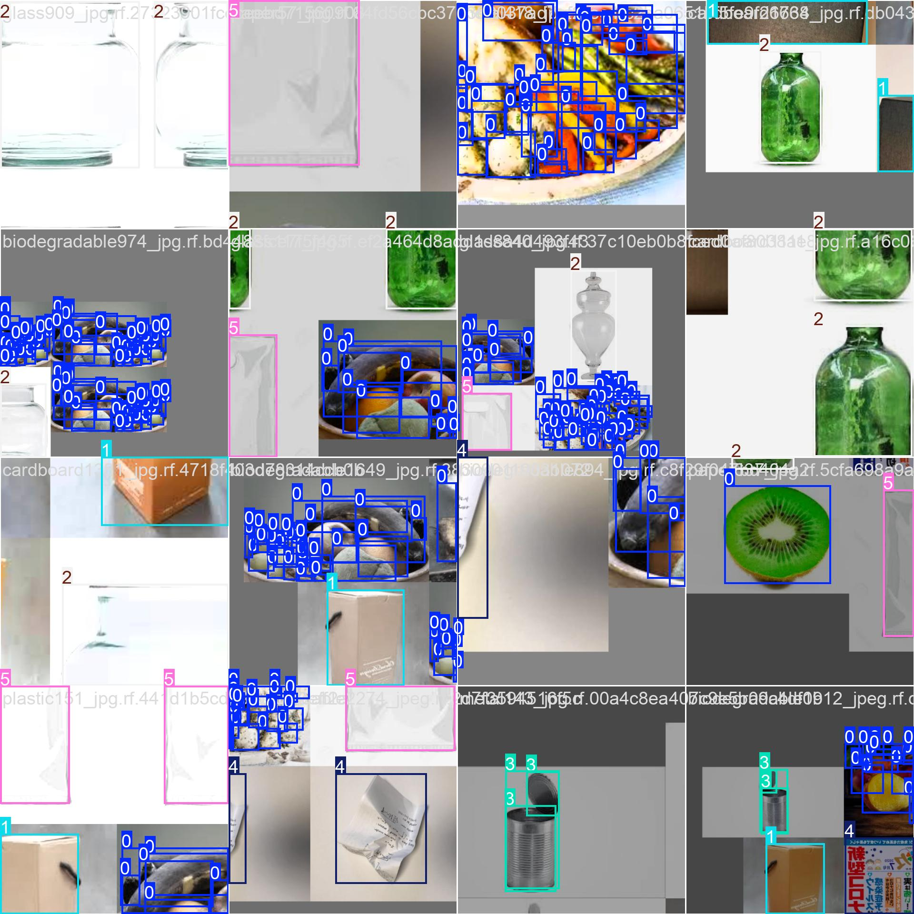
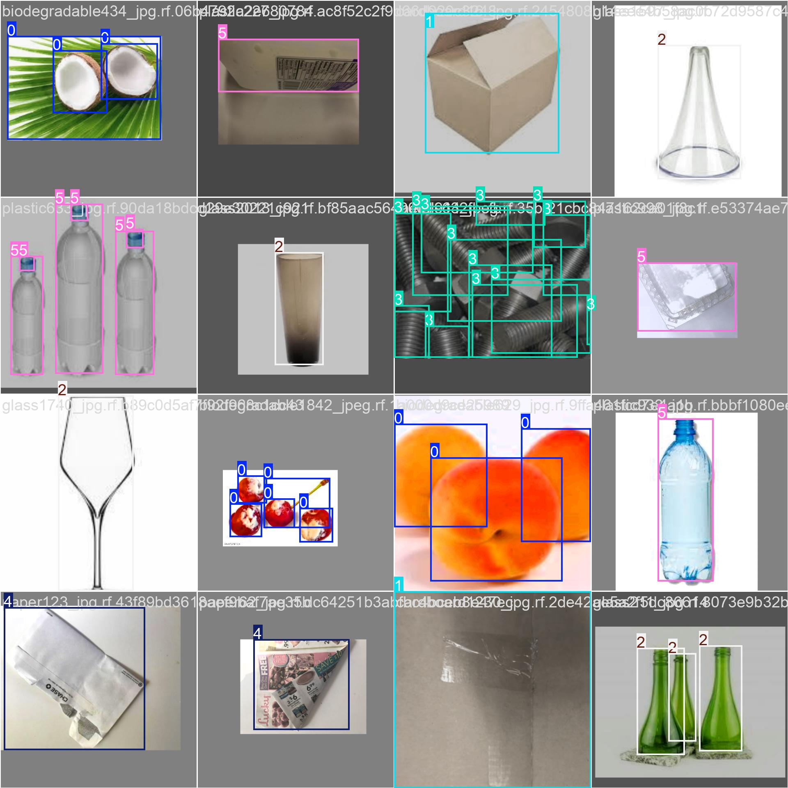
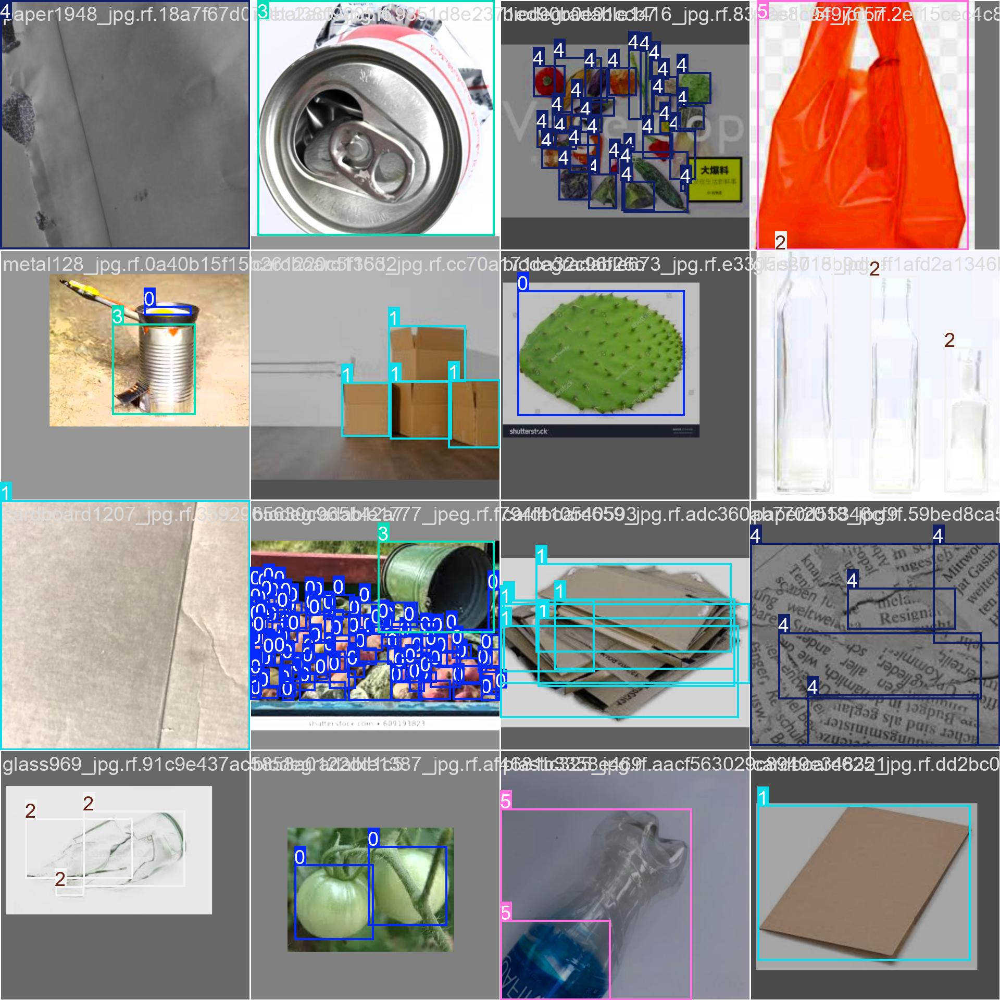
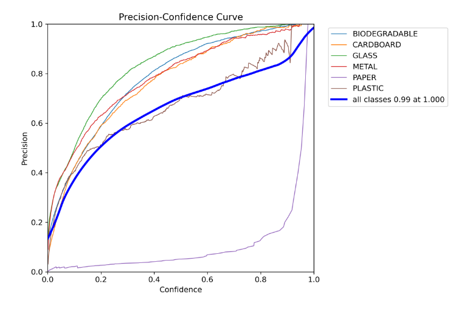
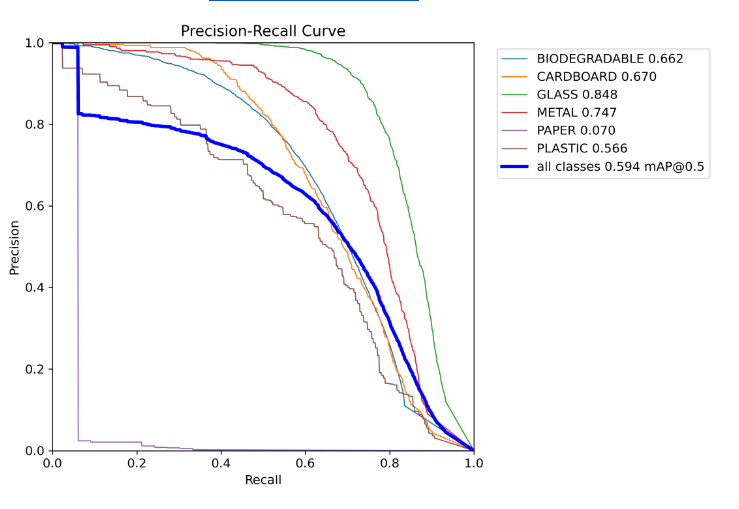
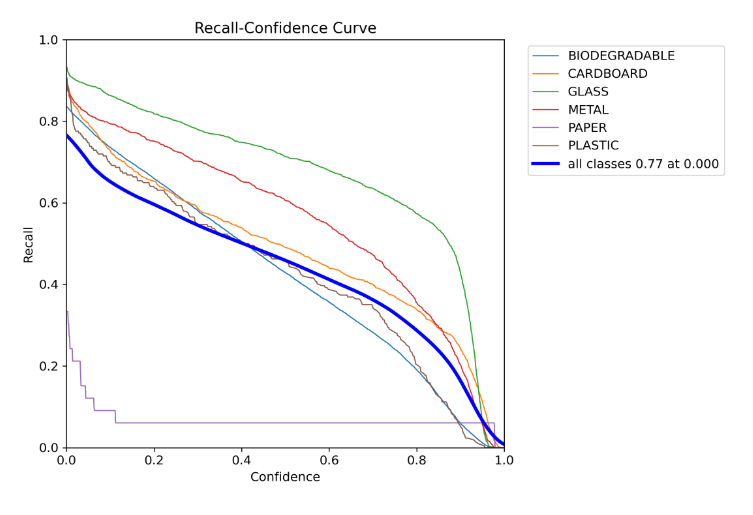

# yolo11n-object-detection

##  Project Overview

This project implements a multi-class object detection system to identify different types of waste materials using the YOLO11n model from the Ultralytics framework.

The goal is to build an efficient model capable of detecting and classifying objects such as plastic, paper, glass, metal, cardboard, and biodegradable waste.

##  Methodology

### 1. Dataset Collection

The dataset was collected and managed using Roboflow. It contains labeled images across multiple classes:

* BIODEGRADABLE
* CARDBOARD
* GLASS
* METAL
* PAPER
* PLASTIC

### 2. Data Preparation

* Dataset split into:

  * Training set
  * Validation set
  * Test set
* Data augmentation techniques were applied automatically during training (e.g., blur, grayscale, contrast enhancement)

##  Model

* Model used: **YOLO11n**
* Framework: Ultralytics YOLO
* Pretrained weights were used (transfer learning)

##  Training Details

* Environment: Google Colab
* Epochs: 40
* Image size: 640
* Optimizer: AdamW

The model was trained using transfer learning, which significantly improves performance and reduces training time.

##  Results

| Metric    | Value |
| --------- | ----- |
| Precision | 0.61  |
| Recall    | 0.53  |
| mAP@50    | 0.59  |
| mAP@50-95 | 0.42  |

These results indicate good performance for a multi-class object detection problem.

##  Analysis

* The model performs well on most classes such as glass and metal.
* However, performance varies due to dataset imbalance.

###  Class Imbalance

Some classes have significantly more samples than others:

* BIODEGRADABLE: very large dataset
* PAPER: very few samples

This imbalance negatively affects the model’s ability to detect underrepresented classes.

##  Sample Predictions

The model outputs bounding boxes with:

* Class labels
* Confidence scores

Example detections include:

* Plastic objects detected with ~70% confidence
* Paper detected with moderate confidence

##  Future Improvements

* Balance the dataset across classes
* Apply advanced data augmentation techniques
* Increase training epochs
* Fine-tune hyperparameters

##  Technologies Used

* Python
* Ultralytics YOLO
* Roboflow
* Google Colab

##  How to Run

This section explains how to reproduce the results of this project.

1. Install dependencies:
pip install ultralytics roboflow

2. Train the model:
from ultralytics import YOLO
model = YOLO("yolo11n.pt")
model.train(data="data.yaml", epochs=40)

3. Run prediction:
model.predict(source="test/images", save=True)

## Sample Results

##  Framework Reference

This project is built using the Ultralytics YOLO framework:
https://github.com/ultralytics/ultralytics

##  Conclusion

This project demonstrates a complete object detection pipeline, including dataset preparation, model training, evaluation, and result visualization using YOLO11n.

##  API Key Required

This project uses a Roboflow API key to access the dataset.

**For my instructor:** Please contact me directly to receive the API key.

>  The key in the code (`"my-api-key"`) is a placeholder. You will need the actual key to run the notebook successfully.
